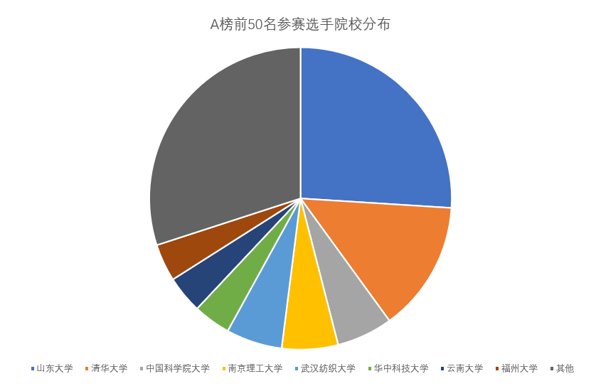

# 基于扩散模型的Jittor草图生成风景


注：第一行是原图，第二行是语义分割图，第三行是我们的模型根据语义图生成的结果。

## 简介

本项目包含了[第二届计图挑战赛计图 - 语义图生成风景比赛](https://www.educoder.net/competitions/index/Jittor-3)的代码实现。我们采用隐空间扩散模型生成风景图，模型分为两阶段：一阶段训练autoencoder，压缩和重建风景图；二阶段训练扩散模型，随机生成噪声，和语义图拼接在一起，映射到一阶段隐空间中进行扩散，最后使用一阶段的decoder对扩散结果进行解码生成风景图。

**成绩**

- A榜：10/154
- B榜：12/31




## 安装 

本项目可在 2 张 rtx titan 上运行。

#### 运行环境

- ubuntu 20.04 LTS
- python >= 3.7
- jittor >= 1.3.0

#### 安装依赖

执行以下命令安装 python 依赖
```
pip install -r requirements.txt
```

### 预训练模型

下载预训练模型 [download link](https://drive.google.com/file/d/1aiWyD1bC6u3ajwEoZol4Br_qNjCa-pJR/view?usp=sharing)，放到`ckpts/`下。

## 数据准备

```python
DATA_DIR/
|-- train_val/
|   |-- 1.jpg
|   |
|   |-- train.txt
|   |-- val.txt
|
|-- test/
|   |-- 1.jpg
|   |
|   |-- test.txt
|
|-- test_B/
|   |-- 1.jpg
|   |
|   |-- test_B.txt

```

在configs文件夹下的配置文件中修改数据集路径。


## 训练

模型分为两阶段：vqgan和ldm，分开训练

- 单卡训练可运行以下命令：
```
python train_vqgan.py

python train_ldm.py 
```

- 多卡训练可以运行以下命令：
```
mpirun --allow-run-as-root -np 2 python train_vqgan.py

mpirun --allow-run-as-root -np 2 python train_ldm.py 
```

## 推理

生成测试集上的结果可以运行以下命令：

```
python inference_jittor.py
```

## 致谢

此项目基于论文 *High-Resolution Image Synthesis with Latent Diffusion Models* 实现，代码参考 [latent-diffusion](https://github.com/CompVis/latent-diffusion)。